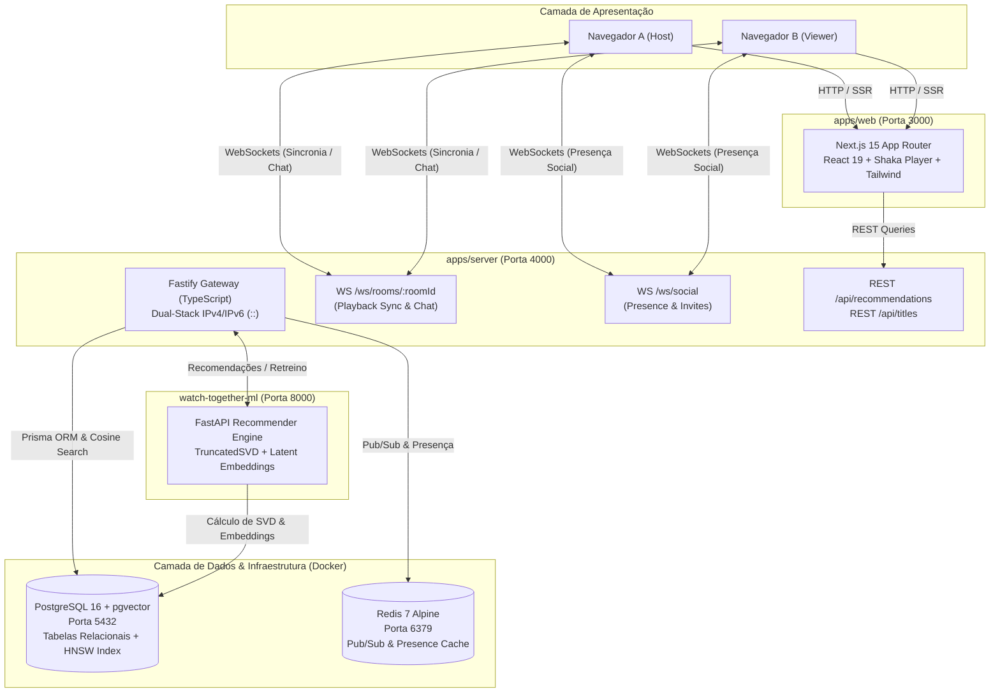

# 🎬 Watch Together — Plataforma Colaborativa de Streaming & Recomendação Inteligente

[](https://github.com/Vlade908/Watch-together/actions/workflows/ci.yml)
[](https://nodejs.org/)
[](https://python.org/)
[](https://github.com/pgvector/pgvector)
[](https://redis.io/)
[](https://nextjs.org/)
[](https://fastify.dev/)
[](LICENSE)

O **Watch Together** é uma plataforma distribuída de streaming de vídeo síncrono (*Watch Party*), presença social contínua em tempo real e sistema de recomendação híbrido impulsionado por inteligência artificial (Fatoração de Matrizes via SVD e busca vetorial em grafos HNSW).

Projetada com arquitetura monorepo desacoplada, alta resiliência e foco em baixa latência, a plataforma oferece uma experiência imersiva com interface com qualidade de estúdio (Netflix-Grade).

---

## ⚡ Destaques de Engenharia

- **Sincronização em Tempo Real de Alta Precisão:**
  - Implementação do **Cristian's Algorithm (NTP)** sobre WebSockets nativos no Fastify para medição de RTT e cálculo de offset de relógio do cliente com precisão sub-milissegundo.
  - Controlador de desvio (*Drift Controller*) em 3 zonas operando em conjunto com o **Shaka Player (HLS/DASH)**:
    1. **Zona 1 (Tight Sync, < 150ms):** Reprodução normal a 1.0x.
    2. **Zona 2 (Soft Drift, 150ms a 1.2s):** Ajuste fino dinâmico da velocidade de reprodução (*playbackRate* entre 0.96x e 1.04x) sem interrupções perceptíveis de áudio/vídeo.
    3. **Zona 3 (Hard Drift, > 1.2s):** Salto corretivo (*seek*) instantâneo para a posição autoritativa do servidor.

- **Camada Social com Presença Contínua:**
  - Canal WebSocket dedicado (`/ws/social`) integrado ao barramento de eventos **Redis Pub/Sub**.
  - Broadcast em tempo real de status de visualização (*"Assistindo Interestelar"*, *online*, *idle*), lobby de salas públicas ativas e envio de convites de sala com entrega instantânea (*toasts*).

- **Motor Híbrido de Recomendação de 2 Camadas:**
  1. **Camada Prioritária (Filtragem Colaborativa por Fatores Latentes):** Microsserviço Python/FastAPI utilizando `TruncatedSVD` (Scikit-Learn) treinado sobre interações explícitas (`UserRating`) e implícitas (`WatchProgress`), projetando fatores em vetores de 1536 dimensões normalizados em L2 gravados na tabela `user_embeddings`.
  2. **Camada de Busca Semântica & Fallback:** Similaridade por cosseno no PostgreSQL 16 utilizando índice de grafo **HNSW (`vector_cosine_ops`)** da extensão `pgvector`, combinada a sinais sociais da rede de amizades e estratégia ponderada de *Cold-Start* para novos perfis.

- **UI Netflix-Grade & Otimização de Renderização:**
  - **Banner Hero Imersivo (85vh)** com reprodução de trailers em alta definição e controle de volume global.
  - **Hover Cards Desacoplados:** Renderização via React Portal para isolamento de camadas de empilhamento (*z-index*), com **auto-dismiss instantâneo em eventos de rolagem vertical da página (`window scroll / wheel`)**, impedindo o congelamento de cards flutuantes.
  - **Top 10 Dinâmico:** Numeração tipográfica SVG sob medida com vetorização dinâmica e contornos de alta fidelidade.

---

## 🏛️ Diagrama de Arquitetura



---

## 📊 Matriz de Serviços, Portas e Protocolos

| Serviço | Diretório | Tecnologia | Porta | Protocolo / Papel Principal |
|---|---|---|---|---|
| **Web Client** | [`apps/web`](./apps/web) | Next.js 15, React 19, Tailwind CSS v4, Shaka Player | `3000` | HTTP / Streaming UI, Controles & Sync HUD |
| **Backend Gateway** | [`apps/server`](./apps/server) | Fastify, WebSockets, Prisma, IORedis | `4000` | HTTP & WS (`/ws/rooms/:id`, `/ws/social`) |
| **ML Engine** | [`watch-together-ml`](./watch-together-ml) | FastAPI, Python 3.11, Scikit-Learn (SVD), Psycopg3 | `8000` | HTTP REST / Treinamento & Inferência de Recomendações |
| **Database** | [`packages/database`](./packages/database) | PostgreSQL 16 + `pgvector` | `5432` | SQL Relacional & Busca Vetorial em Grafos HNSW |
| **Cache & Pub/Sub** | Docker | Redis 7 Alpine | `6379` | Armazenamento de Presença & Barramento Pub/Sub |
| **Transcoder CLI** | [`apps/transcoder`](./apps/transcoder) | Node.js + FFmpeg | N/A | Pipeline HLS ABR (1080p, 720p, 480p) + WebVTT Sprites |

---

## 🚀 Pré-requisitos & Quick Start

### Pré-requisitos
- **Docker & Docker Compose** (para PostgreSQL, Redis e container de ML)
- **Node.js** v20.x ou v22.x (LTS)
- **npm** v10+

---

### 1. Clonar o Repositório e Configurar Variáveis de Ambiente
```bash
git clone https://github.com/Vlade908/Watch-together.git
cd Watch-together
cp .env.example .env
cp .env.example packages/database/.env
```

### 2. Subir a Infraestrutura (Docker)
Inicie o PostgreSQL 16 (`pgvector`), o Redis 7 e o Microsserviço Python:
```bash
docker compose up -d
```

### 3. Instalar Dependências e Inicializar o Banco de Dados
```bash
# Instala as dependências de todos os workspaces
npm install

# Gera o Prisma Client e aplica as migrações
npm run db:generate
npm run db:migrate

# Popula o banco com catálogo de títulos, amigos e avaliações
npm run build --workspace=@watch-together/database
npm run db:seed --workspace=@watch-together/database
```

### 4. Iniciar a Aplicação em Desenvolvimento
```bash
npm run dev
```

Abra no seu navegador:
- **Interface Web:** [http://localhost:3000](http://localhost:3000)
- **Documentação Swagger do ML:** [http://localhost:8000/docs](http://localhost:8000/docs)
- **Health Check do Gateway:** [http://localhost:4000/health](http://localhost:4000/health)

---

## 🛠️ Scripts Úteis do Monorepo

| Comando | Descrição |
|---|---|
| `npm run dev` | Inicia o Servidor Fastify e a aplicação Next.js em paralelo. |
| `npm run dev:all` | Inicia o Servidor Fastify, a aplicação Next.js e o serviço ML Python localmente. |
| `npm run ci:local` / `npm run pre-push` | Executa o pipeline de validação completa: geração de Prisma, typecheck estático de todos os pacotes e build de produção de frontend e backend. |
| `npm run typecheck` | Executa a checagem de tipos estáticos (`tsc --noEmit`) em todos os workspaces. |
| `npm run ml:compile` | Valida sintaxe e compilação de bytecode dos módulos Python em `watch-together-ml`. |
| `npm run ml:retrain` | Dispara via HTTP o retreinamento do modelo SVD e atualização dos fatores latentes no PostgreSQL. |
| `npm run db:studio` | Abre a interface visual do Prisma Studio para inspecionar os registros do banco. |

---

## 📁 Estrutura do Monorepo

```
watch-together/
├── .github/
│   └── workflows/
│       └── ci.yml               # Pipeline CI (Node.js, Python ML e Docker)
├── apps/
│   ├── server/                  # Gateway Fastify + WebSockets + Redis PubSub
│   │   ├── src/
│   │   │   ├── redis/           # Conexão IORedis & PubSub
│   │   │   ├── services/        # Sincronização de salas, presença e recomendações
│   │   │   └── websocket/       # Handlers das salas e canal social
│   ├── transcoder/              # Pipeline FFmpeg HLS Multi-Bitrate e Sprites WebVTT
│   └── web/                     # Frontend Next.js 15 (App Router + React 19)
│       ├── src/
│       │   ├── app/             # Rotas do App Router (/ e /watch/[slug])
│       │   ├── components/      # UI, HeroBanner, Top10Row, FloatingHoverCard, Player
│       │   ├── context/         # SocialContext e CatalogContext
│       │   ├── hooks/           # useWatchTogetherRoom e useRecommendations
│       │   └── services/        # syncEngine.ts (NTP e Drift Controller)
├── packages/
│   └── database/                # Schema Prisma, Migrações PostgreSQL e Seed
├── watch-together-ml/           # Microsserviço Python FastAPI (TruncatedSVD + pgvector)
│   ├── src/
│   │   ├── api/                 # Endpoints REST (/recommend, /retrain, /health)
│   │   ├── recommender.py       # Modelo de Decomposição SVD e Latent Factors
│   │   └── data_loader.py       # Extração unificada de Ratings e WatchProgress
│   ├── Dockerfile
│   └── requirements.txt
├── docker-compose.yml           # Postgres (pgvector), Redis 7 e FastAPI ML
└── package.json                 # Configuração do Monorepo & Workspaces
```

---

## 📄 Licença

Este projeto é distribuído sob a licença **MIT**. Consulte o arquivo [LICENSE](LICENSE) para obter mais detalhes.
