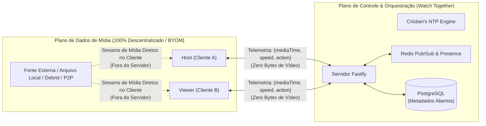
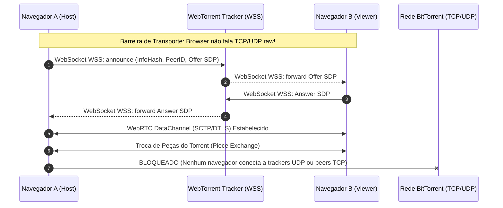
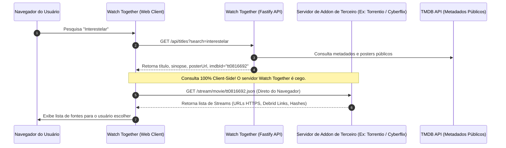
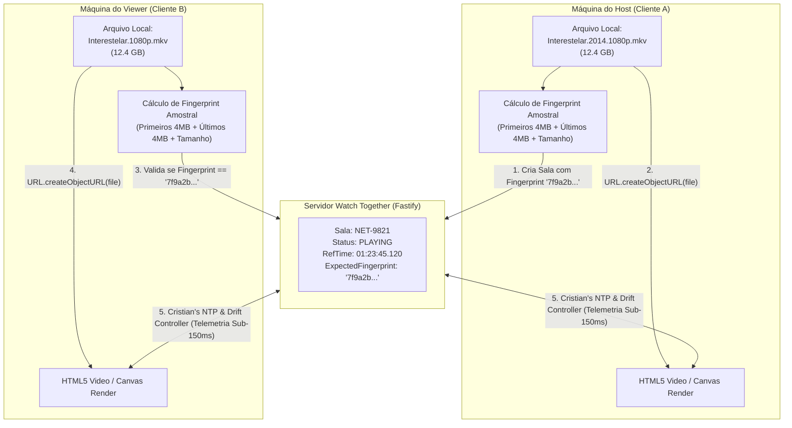
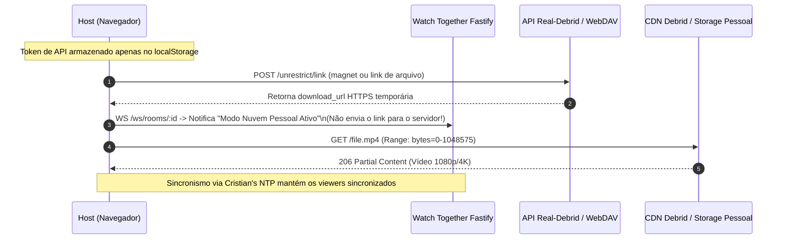
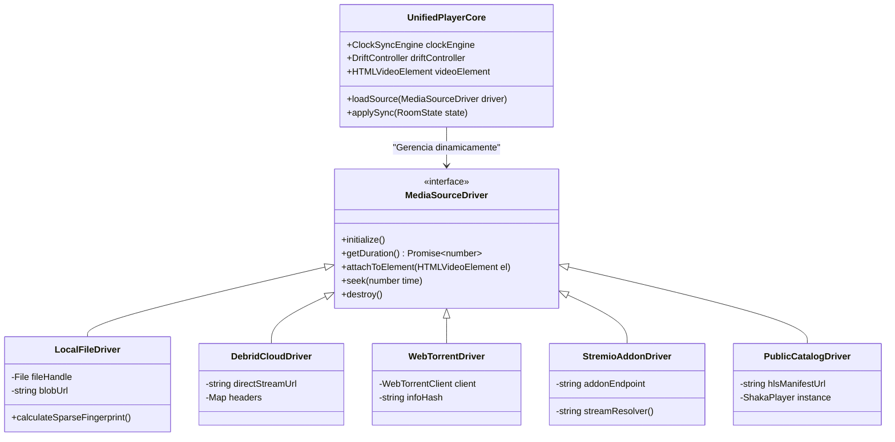
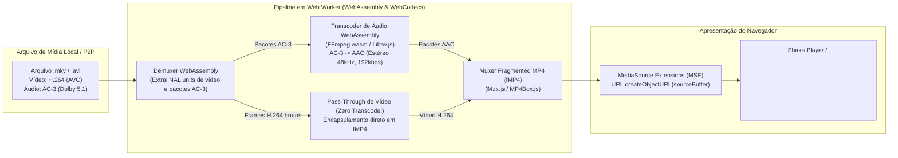
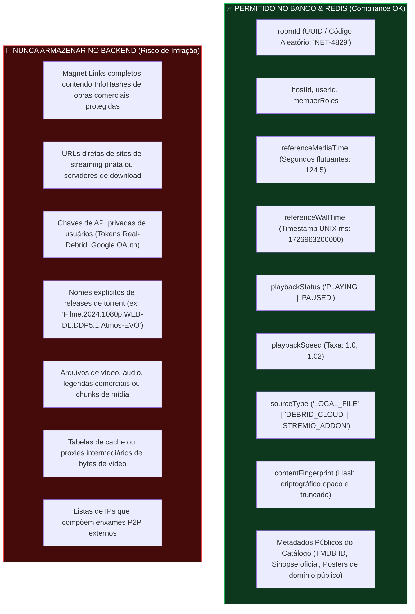
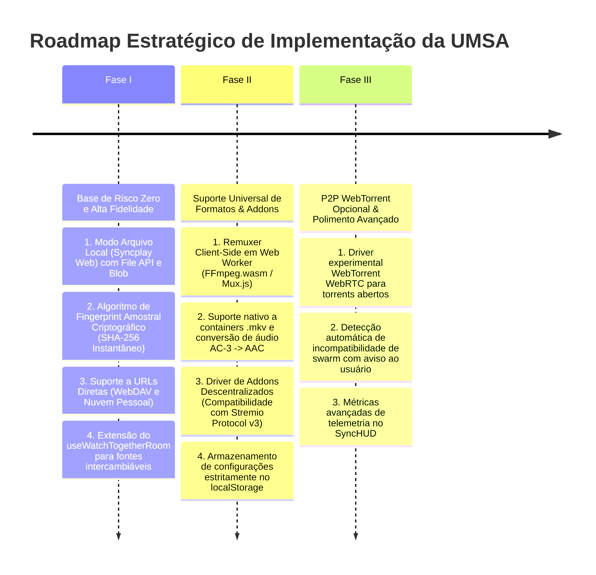

# 🧭 Estudo Exploratório e Arquitetura de Fornecimento de Mídia
## Plataforma Watch Together: Streaming Descentralizado, BYOM e Blindagem Legal

**Data:** 21 de Setembro de 2026  
**Versão:** 1.0.0 — Revisão Técnica e Parecer de Engenharia de Sistemas  
**Classificação:** Arquitetura de Sistemas Distribuídos & Conformidade Regulatória  
**Autor:** Equipe de Arquitetura de Sistemas Distribuídos & Streaming de Mídia  

---

## 📑 Sumário

1. [Sumário Executivo e Posicionamento Estratégico](#1-sumário-executivo-e-posicionamento-estratégico)
   - [1.1. O Desafio Central: A Equação Mídia vs. Responsabilidade Legal](#11-o-desafio-central-a-equação-mídia-vs-responsabilidade-legal)
   - [1.2. O Papel do Watch Together: O Servidor de Relógio Cego (Blind Clock Server)](#12-o-papel-do-watch-together-o-servidor-de-relógio-cego-blind-clock-server)
   - [1.3. Desacoplamento entre Plano de Controle e Plano de Dados](#13-desacoplamento-entre-plano-de-controle-e-plano-de-dados)
2. [Mapeamento Lógico e Viabilidade Técnica das Abordagens Existentes](#2-mapeamento-lógico-e-viabilidade-técnica-das-abordagens-existentes)
   - [2.1. P2P Direto no Navegador (WebTorrent / WebRTC DataChannels)](#21-p2p-direto-no-navegador-webtorrent--webrtc-datachannels)
   - [2.2. Modelo Híbrido de Catálogo + Addons Descentralizados (Padrão Stremio)](#22-modelo-híbrido-de-catálogo--addons-descentralizados-padrão-stremio)
   - [2.3. Sincronização de Arquivo Local com Hash Matching (Padrão Syncplay Web)](#23-sincronização-de-arquivo-local-com-hash-matching-padrão-syncplay-web)
   - [2.4. Integração com Nuvem Pessoal e Provedores Debrid](#24-integração-com-nuvem-pessoal-e-provedores-debrid)
3. [Proposição de uma Nova Abordagem: Arquitetura Multi-Fonte Unificada (UMSA)](#3-proposição-de-uma-nova-abordagem-arquitetura-multi-fonte-unificada-umsa)
   - [3.1. Visão Geral da Arquitetura Multi-Fonte Unificada](#31-visão-geral-da-arquitetura-multi-fonte-unificada)
   - [3.2. As 5 Modalidades Intercambiáveis de Fonte](#32-as-5-modalidades-intercambiáveis-de-fonte)
   - [3.3. O Dilema de Codecs/Containers e a Solução Client-Side via WebAssembly](#33-o-dilema-de-codecscontainers-e-a-solução-client-side-via-webassembly)
   - [3.4. Pipeline de Áudio: WebCodecs e Web Audio API](#34-pipeline-de-áudio-webcodecs-e-web-audio-api)
4. [Blindagem Jurídica, Conformidade e Arquitetura de Dados Zero-Knowledge](#4-blindagem-jurídica-conformidade-e-arquitetura-de-dados-zero-knowledge)
   - [4.1. Enquadramento Legal Internacional e Brasileiro](#41-enquadramento-legal-internacional-e-brasileiro)
   - [4.2. Matriz de Auditoria de Dados: O que PODE vs. O que NUNCA DEVE ser Armazenado](#42-matriz-de-auditoria-de-dados-o-que-pode-vs-o-que-nunca-deve-ser-armazenado)
   - [4.3. Isenção de Responsabilidade nos Termos de Uso (Termos de Serviço / EULA)](#43-isenção-de-responsabilidade-nos-termos-de-uso-termos-de-serviço--eula)
5. [Matriz Comparativa Abrangente](#5-matriz-comparativa-abrangente)
6. [Recomendação Arquitetural e Roadmap Faseado de Implementação](#6-recomendação-arquitetural-e-roadmap-faseado-de-implementação)

---

## 1. Sumário Executivo e Posicionamento Estratégico

### 1.1. O Desafio Central: A Equação Mídia vs. Responsabilidade Legal

A criação de uma plataforma colaborativa de exibição de mídia (*Watch Party*) com interface de nível estúdio e sistema de recomendação por inteligência artificial (como a estrutura atual com Next.js 15, Fastify, Redis, PostgreSQL e microsserviço de ML) enfrenta uma encruzilhada mandatória:

$$\text{Risco de Responsabilidade Civil/Penal} \propto \int (\text{Bytes de Conteúdo Hospedados} + \text{Tráfego Intermediado} + \text{Indexação de Links Infratores}) \, dt$$

Se a infraestrutura da plataforma (servidores Fastify, volumes Docker, discos corporativos ou proxies de rede) armazenar, converter, transcodificar ou fazer proxy de um único arquivo audiovisual protegido por direitos autorais sem licenciamento expresso dos distribuidores, a plataforma deixa de ser um mero provedor de aplicação e passa a responder diretamente por **infração direta e subsidiária de direitos autorais** (*copyright infringement*), sujeitando os mantenedores a processos cíveis milionários, apreensão de infraestrutura e ordens judiciais de bloqueio por liminares de DNS e IP.

### 1.2. O Papel do Watch Together: O Servidor de Relógio Cego (Blind Clock Server)

Para atingir **Risco Zero de Pirataria**, o **Watch Together** deve adotar o princípio formal de **Provedor Neutro de Sinalização e Telemetria de Relógio** (*Blind Clock & Conduit Provider*).



A premissa fundamental da plataforma é:
1. **Inexistência de Bytes de Mídia no Servidor:** O servidor nunca efetua `download`, `transcode`, `cache`, `stream` ou `relay` de pacotes de vídeo/áudio.
2. **Inexistência de Diretório Centralizado de Pirataria:** O banco de dados nunca salva magnet links de torrents de filmes comerciais nem URLs de pirataria atreladas a salas públicas.
3. **Sinalização Agnosticismo:** O protocolo de salas (`/ws/rooms/:roomId`) opera exclusivamente com grandezas matemáticas:
   - `referenceMediaTime`: tempo decorrido no vídeo (ex: `124.58` segundos).
   - `referenceWallTime`: timestamp de relógio do servidor em milissegundos (`Date.now()`).
   - `playbackSpeed`: taxa de reprodução (`1.0x`, `1.02x`, etc.).
   - `status`: `"PLAYING"` ou `"PAUSED"`.
   - `contentFingerprint`: hash opaco e truncado de verificação de compatibilidade mútua entre clientes.

### 1.3. Desacoplamento entre Plano de Controle e Plano de Dados

A arquitetura estabelece uma separação hermética entre dois planos de engenharia:

| Dimensão | **Plano de Controle (Control Plane)** | **Plano de Dados (Data Plane)** |
|---|---|---|
| **Onde Executa** | Servidor Backend (`apps/server`, Fastify, Redis, Postgres) | Navegadores dos Clientes (`apps/web`, Next.js, Shaka Player) |
| **Tráfego** | Pacotes JSON de sinalização WebSocket e chamadas REST de catálogo | Fluxos binários de vídeo (MPEG-4, WebM, fMP4, WebRTC DataChannels) |
| **Largura de Banda Exigida** | Baixíssima (~1 a 5 KB/s por usuário em telemetria e chat) | Alta (~2 a 25 Mbps por usuário dependendo da resolução 1080p/4K) |
| **Responsabilidade Legal** | **Zero.** Trata apenas de sincronismo temporal neutro e comunicação textual | **Do Usuário.** O usuário decide de onde consome o arquivo e como o reproduz |

---

## 2. Mapeamento Lógico e Viabilidade Técnica das Abordagens Existentes

Analisamos rigorosamente os 4 grandes modelos descentralizados existentes na indústria:

---

### 2.1. P2P Direto no Navegador (WebTorrent / WebRTC DataChannels)

#### Funcionamento Lógico
O protocolo WebTorrent permite transferências BitTorrent peer-to-peer diretamente no navegador através da encapsulação do protocolo BitTorrent wire sobre **WebRTC DataChannels** (utilizando SCTP sobre DTLS/UDP).



#### Viabilidade de Reproduzir via Magnet Links / InfoHash dentro do Navegador
1. **O "Muro de Berlim" da Rede BitTorrent:**
   - A rede BitTorrent mundial tradicional (uTorrent, qBittorrent, Transmission) comunica-se através de sockets TCP brutos e rastreadores baseados em UDP (`udp://tracker...`) com extensões DHT (Distributed Hash Table) via Kademlia UDP.
   - **Por restrições estritas de segurança da Sandbox de navegadores Web (W3C), nenhum browser tem permissão para abrir sockets UDP brutos ou conexões TCP arbitrárias.**
   - Consequentemente, uma biblioteca JavaScript rodando em Next.js (como `webtorrent`) **NÃO CONSEGUE** se conectar aos milhões de seeds da rede BitTorrent convencional.
   - O navegador só consegue baixar e semear com peers que também estejam executando um cliente WebRTC habilitado (outros navegadores ou clientes desktop híbridos como Brave Browser ou WebTorrent Desktop) e conectados a **rastreadores WebRTC especiais baseados em WebSocket seguro (`wss://tracker.openwebtorrent.com`)**.
   - **Impacto Real:** Um torrent comum com 5.000 seeds na rede pública frequentemente reporta **0 seeds** dentro de uma sessão web pura, a menos que alguém monte um serviço de "Bridge/Relay" dedicado (o que reintroduziria risco de servidor de proxy).

2. **Gargalos Brutais de Containers e Codecs no HTML5 / Shaka Player:**
   - **Containers:** A imensa maioria dos lançamentos em redes P2P são empacotados em contêineres **Matroska (`.mkv`)** ou **`.avi`**. O elemento `<video>` do navegador e o Shaka Player suportam nativamente apenas `.mp4` (fragmented MP4) e `.webm`. Ao tentar reproduzir um blob `.mkv` diretamente no `<video src="blob:...">`, a maioria dos navegadores retorna `MEDIA_ERR_SRC_NOT_SUPPORTED`.
   - **Patentes de Áudio:** 90% dos filmes e séries em torrent contêm trilhas de áudio em **Dolby Digital (AC-3)**, **Dolby Digital Plus (E-AC-3)** ou **DTS / DTS-HD MA**. Por razões de licenciamento e royalties proprietários, navegadores como Google Chrome, Mozilla Firefox e Apple Safari não incluem decodificadores de software livres para DTS ou AC-3 na maioria dos sistemas operacionais (exceto em casos pontuais com hardware passthrough em macOS/Edge no Windows com codecs instalados). O resultado é: o vídeo pode até carregar, mas o filme fica **completamente mudo**.
   - **HEVC / H.265:** Embora o suporte venha melhorando gradualmente via aceleração de hardware em GPUs modernas, muitos navegadores em Linux e equipamentos legados rejeitam fluxos HEVC empacotados em WebTorrent, disparando falhas no pipeline de decodificação.

3. **Gargalo de Churn e Streaming Sequencial:**
   - O algoritmo padrão do BitTorrent prioriza peças mais raras (*rarest-first*). Para streaming síncrono no player, o cliente precisa forçar download sequencial das peças iniciais e do buffer imediato.
   - Se o peer que está assistindo com o Host sofrer oscilação de taxa de transferência ou se o swarm tiver baixa disponibilidade de peças no WebRTC, o buffer congela, forçando o *Drift Controller* do Watch Together a frear ou saltar a reprodução repetidamente.

---

### 2.2. Modelo Híbrido de Catálogo + Addons Descentralizados (Padrão Stremio)

#### Lógica do Ecossistema Stremio
O Stremio tornou-se o padrão ouro de isolamento legal no setor de entretenimento. Ele opera separando estritamente:
1. **Aplicação Central (Core / UI):** Provê apenas a interface do usuário, a busca de metadados em fontes abertas e legais (TMDB, TVMaze, IMDb, TheTVDB) e a gestão de contas/favoritos.
2. **Protocolo de Addons (Stremio Addon Protocol v3):** Um padrão de API HTTP/JSON ultra-simples que define três endpoints principais:
   - `GET /manifest.json`: Descreve o plugin, nome, versão, recursos (`catalog`, `stream`, `subtitles`) e tipos suportados (`movie`, `series`).
   - `GET /catalog/{type}/{id}.json`: Retorna coleções de metadados.
   - `GET /stream/{type}/{id}.json`: Onde `{id}` é o código de metadados (ex: IMDb `tt0816692` para *Interestelar*). O addon responde com uma lista de possíveis origens de stream:
     ```json
     {
       "streams": [
         {
           "title": "1080p BluRay x264 AAC",
           "url": "https://direct-stream-provider.com/file123.mp4",
           "behaviorHints": { "notWebReady": false }
         },
         {
           "title": "4K HDR Torrent [Seeds: 142]",
           "infoHash": "a1b2c3d4e5f67890abcdef1234567890abcdef12",
           "fileIdx": 0
         }
       ]
     }
     ```



#### Vetor de Isolamento Legal e Técnico
- **Blindagem do Servidor:** O backend do Watch Together **nunca consulta, nunca armazena e nunca hospeda** os addons nem suas respostas. O usuário cadastra a URL do manifesto do addon (ex: `https://seu-addon-privado.com/manifest.json`) que fica gravada unicamente no `localStorage` ou `IndexedDB` do navegador do usuário.
- **Isenção sob Doutrina de Link Neutro:** O servidor atua tal como um navegador Web (Google Chrome) ou reprodutor de mídia (VLC Media Player), incapaz de prever ou interferir no plugin configurado pelo operador da ponta.

#### Desafios no Contexto Web (Next.js no Browser)
- **CORS (Cross-Origin Resource Sharing):** No Stremio Desktop (construído em C++/Qt ou Electron), o runtime ignora regras de CORS de navegadores. No entanto, se o Watch Together for uma SPA/PWA executada dentro do Chrome/Firefox, qualquer requisição de `fetch('https://addon-servidor/stream/...')` disparada pelo cliente será bloqueada se o servidor do addon não enviar os cabeçalhos `Access-Control-Allow-Origin: *`.
- **Mixed Content (HTTPS vs. HTTP):** Como a aplicação web do Watch Together roda em ambiente de produção seguro (`https://`), qualquer stream gerado por um addon que aponte para um link sem certificado SSL (`http://...`) será sumariamente bloqueado pelo navegador como violação de conteúdo misto.

---

### 2.3. Sincronização de Arquivo Local com Hash Matching (Padrão Syncplay Web)

#### Lógica Operacional e Fluxo de Pacotes
O padrão **Syncplay** é o expoente máximo de neutralidade legal e desempenho técnico para grupos de amigos e cinéfilos que já possuem seus próprios arquivos de mídia (adquiridos de backups pessoais, filmagens, cópias digitais ou distribuições locais).



1. **Acesso Local Seguro via Web:**
   - O usuário utiliza a `HTML5 File API` padrão (`<input type="file" accept="video/*">`) ou a moderna `File System Access API` (`window.showOpenFilePicker()`).
   - O arquivo **nunca sai do computador do usuário**. O navegador cria uma URL de ponte interna em memória:
     ```typescript
     const localBlobUrl = URL.createObjectURL(selectedFile);
     videoElement.src = localBlobUrl;
     ```
2. **Algoritmo de Integridade e Hash Matching Instantâneo:**
   - Calcular o hash SHA-256 de um arquivo de vídeo 4K de 35 GB no navegador em JavaScript demoraria vários minutos, sobrecarregando o processador e tornando a experiência frustrante.
   - **A Solução: Fingerprint Amostral Criptográfico (Sparse Multi-Chunk Hashing):**
     - Leitura com `FileReader.readAsArrayBuffer()` apenas dos fragmentos estruturais determinísticos do arquivo:
       - Bloco 1: Primeiros 4 MB (cabeçalho do container, metadados EBML/moov atom).
       - Bloco 2: 4 MB do centro exato do arquivo ($Offset = \text{FileSize} / 2$).
       - Bloco 3: Últimos 4 MB (metadados de rodapé, índices de clusters).
       - Dimensão Exata: Tamanho total do arquivo em bytes (`file.size`).
       - Duração: Duração do container extraída via metadados do navegador (`video.duration`).
     - Processamento via `crypto.subtle.digest("SHA-256", combinedBuffer)`.
     - **Tempo de Execução:** Menos de **180 milissegundos**, mesmo para arquivos superiores a 50 GB.
3. **Fluxo de Sala e Tolerância:**
   - O Host seleciona o arquivo e cria a sala. O servidor armazena apenas o hash resumido de compatibilidade (`fingerprint`).
   - Quando o Convidado entra na sala e seleciona seu próprio arquivo, o cliente calcula o fingerprint local:
     - Se for **idêntico**: Sinal verde total no *SyncHUD* (compatibilidade perfeita de quadros por segundo e duração).
     - Se for **diferente**: O sistema emite um aviso contextual: *"Seu arquivo possui duração ou release diferente da versão do Host (+2.4s de diferença). A sincronização temporal funcionará, mas poderá haver pequenas discrepâncias em cenas cortadas."*

#### Benefícios Excepcionais
- **Banda Zero no Servidor:** O tráfego de dados no servidor do Watch Together para streaming é **0 bytes**.
- **Qualidade Imbatível:** Reprodução com taxa de bits nativa sem compressão de rede (4K Remux a 80 Mbps roda perfeitamente liso, pois está sendo lido diretamente do SSD local do usuário via canal de barramento PCI-e/SATA).
- **Inatacabilidade Jurídica:** Nenhuma comunicação pública, transmissão ou retransmissão de obra ocorre entre computadores ou servidores da plataforma. Cada participante assiste unicamente ao seu próprio arquivo que já detém licitamente em sua posse física.

---

### 2.4. Integração com Nuvem Pessoal e Provedores Debrid

#### Funcionamento Lógico
Neste formato, o usuário conecta fontes de dados remotas proprietárias onde ele armazena ou despacha mídias:
1. **Serviços de Nuvem Pessoal (Google Drive, OneDrive, Dropbox, WebDAV, Nextcloud):**
   - O usuário autentica via OAuth2 client-side ou insere credenciais de um servidor WebDAV particular.
   - O cliente web obtém links diretos de download ou monta requisições autenticadas com cabeçalho `Range: bytes=X-Y` diretamente contra o storage da nuvem.
2. **Servidores Privados de Mídia (Plex / Jellyfin):**
   - O usuário insere a URL do seu servidor caseiro e sua chave de autenticação (`X-Plex-Token` ou Jellyfin Access Token).
   - O player consome diretamente os fluxos HLS/DASH gerados sob demanda pelo servidor privado do próprio usuário.
3. **Serviços Debrid (Real-Debrid, AllDebrid, Premiumize):**
   - Provedores Debrid funcionam como pontes de download em nuvem de alta velocidade. O usuário fornece um magnet link ou hash para a API do Debrid, os servidores do Debrid descarregam o arquivo em cache e fornecem um link HTTPS irrestrito (`unrestricted link`) de altíssima velocidade com suporte a Range Requests.



#### Considerações Críticas de Arquitetura e Limitações
1. **Isolamento de Credenciais (Zero-Knowledge Auth):**
   - As chaves de API, credenciais WebDAV e tokens de serviços de nuvem devem residir **exclusivamente no navegador do usuário (`localStorage`)**. Jamais devem transitar pelo Fastify ou serem gravadas nas tabelas de banco de dados do Watch Together.
2. **A Barreira do IP-Lock dos Provedores Debrid:**
   - A esmagadora maioria dos serviços Debrid (como Real-Debrid) aplica uma política rígida de **bloqueio por endereço IP**:
     - Se o Host gerar um link de download irrestrito usando sua conta Debrid e tentar compartilhá-lo com amigos na sala, os amigos receberão erro `403 Forbidden` ao tentar baixar do mesmo link, pois a CDN do Debrid detecta que as requisições estão partindo de endereços IP residenciais diferentes do IP que solicitou o unrestrict.
     - **Conclusão:** Cada membro da sala que optar por essa modalidade precisa fornecer sua própria conta/token, ou o link precisa vir de um provedor que não force IP-locking (como WebDAV próprio ou Google Drive compartilhado).

---

## 3. Proposição de uma Nova Abordagem: Arquitetura Multi-Fonte Unificada (UMSA)

### 3.1. Visão Geral da Arquitetura Multi-Fonte Unificada

Propomos a concepção da **Arquitetura Multi-Fonte Unificada (Unified Multi-Source Architecture - UMSA)**. A essência desta inovação consiste em **separar 100% o motor de sincronismo temporal (Time Base & Drift Synchronization) da camada de fornecimento do transporte de mídia (Media Transport Layer)**.

No modelo tradicional, o player é rigidamente acoplado a uma URL de manifesto estática. Na UMSA, o Watch Together opera como um **Orquestrador de Telemetria Neutro** e o cliente web conta com uma interface polimórfica de drivers de mídia:



### 3.2. As 5 Modalidades Intercambiáveis de Fonte

Ao criar ou configurar uma sala no Watch Together, o Host define a **Modalidade de Mídia da Sessão**:

```
[ MODALIDADES DE SALA DISPONÍVEIS NO WATCH TOGETHER ]
├── 1. MODO ARQUIVO LOCAL (Syncplay Web)      --> BYOM absoluto; zero dados trafegados; hash match.
├── 2. MODO NUVEM PESSOAL & DEBRID           --> Google Drive, WebDAV, Real-Debrid individual.
├── 3. MODO ADDONS / EXTENSÃO CLIENTE        --> Resolução client-side via manifesto Stremio v3.
├── 4. MODO P2P WEBTORRENT (WebRTC Swarm)    --> Enxame P2P direto entre navegadores compatíveis.
└── 5. MODO CATÁLOGO PÚBLICO / DEMO (HLS)    --> Fallback oficial atual com Shaka Player (HLS/DASH).
```

1. **`LOCAL_FILE`:** O Host arrasta seu arquivo `.mp4`/`.mkv`. O sistema extrai o fingerprint amostral. Os participantes entram na sala e carregam suas cópias do arquivo. O servidor sincroniza os tempos com o *Cristian's NTP* já implementado no Fastify.
2. **`DEBRID_CLOUD`:** O Host insere uma URL de stream direto ou conecta sua conta de nuvem/Debrid. Seus amigos que possuem suas contas ativas resolvem o link e assistem em perfeita sintonia.
3. **`CLIENT_ADDON`:** A interface da sala consulta o catálogo neutro (TMDB). Ao clicar em reproduzir, os addons do cliente listam os streams e o player consome a fonte selecionada sem intermediários.
4. **`P2P_WEBTORRENT`:** Utilizado para distribuições abertas e arquivos semeados via WebRTC. O player carrega as peças em buffer sequencial.
5. **`PUBLIC_CATALOG_STREAM`:** O pipeline atual (HLS multi-bitrate test stream do Mux e títulos abertos de domínio público hospedados externamente).

---

### 3.3. O Dilema de Codecs/Containers e a Solução Client-Side via WebAssembly

#### O Problema Real
Se um usuário tentar executar o **Modo Arquivo Local** ou baixar via P2P um filme com container `.mkv` codificado em H.264 com áudio **AC-3 (Dolby Digital de 6 canais)**, o navegador falhará imediatamente:
1. O elemento nativo `<video>` não reconhece o container Matroska.
2. O sistema de áudio do navegador não possui a licença binária para decodificar o codec AC-3.

#### Como Resolver 100% no Cliente sem Servidor de Transcodificação?

Recorrer a um servidor central com FFmpeg em Docker (como no `apps/transcoder`) destruiria a meta de **Risco Zero de Pirataria**, pois o servidor estaria decodificando e convertendo mídias com direitos autorais. A transcodificação **deve acontecer dentro da máquina do cliente**.

Apresentamos a arquitetura do **Client-Side Remuxing & Transcoding Engine**:



#### Análise Técnica da Estratégia "Video Passthrough + Audio Transcode"
- **Por que NÃO transcodificar o vídeo no browser?**
  - O vídeo H.264/AVC consome de 85% a 95% do poder de processamento em qualquer operação de re-encoding. Transcodificar vídeo 1080p ou 4K via software em WebAssembly causaria sobreaquecimento extremo da CPU, esgotamento instantâneo de bateria em laptops e taxa de renderização inferior a 10 frames por segundo (unplayable).
  - Como praticamente **todos os navegadores do mundo já possuem decodificação de hardware nativa para H.264**, o vídeo não precisa ser alterado. Ele é apenas retirado do container `.mkv` e inserido num container `.mp4` fragmentado (*demux/remux*). O custo computacional do remuxing de vídeo é **insignificante (< 1% de CPU)**.
- **Transcodificação de Áudio (AC-3 $\to$ AAC):**
  - O áudio demanda menos de **1.5% do processamento de um único núcleo de CPU moderno**.
  - Um WebAssembly leve compilado exclusivamente com as bibliotecas de áudio do FFmpeg (`libavcodec` com `ac3_decoder` e `aac_encoder`) consegue decodificar AC-3 e re-encodar para AAC em tempo 20x mais rápido que o tempo real (*20x realtime speed*).
  - Os chunks de vídeo H.264 e áudio AAC são combinados em fragmentos fMP4 (`.mp4` compatíveis com ISO BMFF) e entregues à API de padrão aberto **MediaSource Extensions (MSE)**. O Shaka Player os reproduz como se fossem um stream de rede legítimo.

---

### 3.4. Pipeline de Áudio: WebCodecs e Web Audio API

Para navegadores modernos que suportam a nova especificação **WebCodecs API** (Google Chrome 94+, Edge 94+):
1. **`AudioDecoder` Nativo:** Permite alimentar blocos de bits comprimidos em uma fila de hardware/software de baixa latência e receber objetos `AudioData` contendo amostras PCM lineares puras.
2. **`AudioContext` (Web Audio API):** As amostras PCM podem ser direcionadas diretamente para o pipeline do sistema operacional via `AudioBufferSourceNode` ou `AudioWorkletNode`, contornando limitações de codecs do elemento `<video>` nativo sem nem sequer necessitar de re-empacotamento em fMP4.

---

## 4. Blindagem Jurídica, Conformidade e Arquitetura de Dados Zero-Knowledge

### 4.1. Enquadramento Legal Internacional e Brasileiro

Para blindar formalmente o Watch Together, sua arquitetura e seus operadores legais contra qualquer imputação de crime ou responsabilidade solidária por violação de propriedade intelectual, a engenharia deve alinhar o sistema aos quatro maiores marcos mundiais de imunidade de rede:

```
[ REGIMES DE IMUNIDADE JURÍDICA E COMPLIANCE ]
├── 1. ESTADOS UNIDOS: DMCA Safe Harbor (17 U.S.C. § 512)
│     ├── § 512(a): Transitory Digital Network Communications (Conduto Puro)
│     └── § 512(c): Storage at Direction of Users (Sem responsabilidade por conduta de terceiros)
├── 2. BRASIL: Marco Civil da Internet (Lei 12.965/2014) & LDA (Lei 9.610/1998)
│     ├── Art. 19: Provedor de aplicação não responde civilmente por atos de terceiros sem ordem judicial
│     └── Neutralidade da Rede: O transporte de dados não discrimina conteúdo
├── 3. UNIÃO EUROPEIA: Diretiva de Direitos Autorais (Art. 17) & DSA (Digital Services Act)
│     └── Exclusão expressa de provedores que fornecem apenas ferramentas de telecomunicação
└── 4. DOUTRINA BETAMAX / SONY CORP. (Suprema Corte dos EUA)
      └── Uma tecnologia com "usos substanciais não-infratores" é intrinsecamente lícita
```

#### Critérios Mandatórios para Safe Harbor Conforme 17 U.S.C. § 512(a):
1. A transmissão do material deve ser iniciada exclusivamente por solicitação do usuário, e não pelo provedor.
2. A transmissão, roteamento ou conexão deve ser realizada por um processo técnico automático, sem seleção do material pelo provedor.
3. O provedor não deve selecionar os destinatários do material, exceto como resposta automática à solicitação de outra pessoa.
4. Nenhuma cópia do material deve ser mantida no sistema ou rede de forma acessível a qualquer outra pessoa além dos destinatários pretendidos, e não por mais tempo do que o razoavelmente necessário para a transmissão.
5. O material deve ser transmitido sem modificação de seu conteúdo.

---

### 4.2. Matriz de Auditoria de Dados: O que PODE vs. O que NUNCA DEVE ser Armazenado

Abaixo, a especificação rígida de schema para o banco de dados PostgreSQL e chaves de cache do Redis:



#### Tabela Detalhada de Conformidade do Banco de Dados

| Entidade / Campo | Onde Gravar? | Pode Gravar? | Justificativa Técnica & Jurídica |
|---|---|:---:|---|
| `roomId`, `code`, `name` | PostgreSQL / Redis | **SIM** | Identificadores neutros de sessão colaborativa. |
| `referenceMediaTime`, `referenceWallTime` | Redis (Estado em tempo real) | **SIM** | Variáveis de física do tempo para o *Cristian's Algorithm*. Não constituem conteúdo. |
| `sourceType` (Enum: `LOCAL`, `EXTERNAL`) | PostgreSQL | **SIM** | Classificação de modo de operação da sala. |
| `contentFingerprint` | PostgreSQL / Redis | **SIM** | Resumo matemático opaco (ex: primeiros 16 chars do SHA-256 amostral) usado apenas para avisar se dois usuários abriram arquivos equivalentes. É matematicamente impossível reconstruir o filme a partir do hash. |
| `magnetLink` / `torrentInfoHash` | Banco de Dados | 🚫 **NUNCA** | Armazenar hashes de torrents comerciais associados a títulos de filmes cria presunção de indexação deliberada de pirataria (*contributory infringement*). O magnet link deve ficar restrito à memória de execução do cliente ou trânsito P2P. |
| `streamUrl` externa não autenticada | Banco de Dados | 🚫 **NUNCA** | URLs que apontam para servidores piratas expõem a plataforma a takedowns de DMCA diretos na infraestrutura do Fastify. |
| `apiKey` / `debridToken` | Banco de Dados | 🚫 **NUNCA** | Violação flagrante de privacidade e da LGPD/GDPR. Se o banco vazar, todas as contas de nuvem dos usuários seriam expostas. Devem residir exclusivamente no `localStorage` do browser. |
| Arquivos de Mídia (`.mp4`, `.mkv`, `.ts`) | Volumes Docker / S3 | 🚫 **NUNCA** | A plataforma não é um storage de mídia. O disco do servidor deve conter unicamente os binários da aplicação e o banco relacional. |

---

### 4.3. Isenção de Responsabilidade nos Termos de Uso (Termos de Serviço / EULA)

Para assegurar proteção contratual irrevogável, as salas do Watch Together devem incorporar e exibir expressamente as seguintes cláusulas:

1. **Cláusula de Ferramenta Neutra de Sinalização (Neutral Signaling Conduit):**
   > *"O Watch Together é um software de comunicação e telemetria de relógio que permite a sincronização de eventos de reprodução entre dispositivos de usuários remotos. O Watch Together não é um serviço de hospedagem de vídeos, não mantém diretórios de conteúdo protegido, não efetua transmissões de mídia e não incentiva nem endossa a reprodução de conteúdos sem a devida autorização dos titulares dos direitos."*
2. **Cláusula de Responsabilidade Exclusiva do Usuário (BYOM - Bring Your Own Media):**
   > *"O usuário reconhece e concorda que é o único e exclusivo responsável pela origem, legalidade, posse e reprodução de qualquer arquivo, link, serviço de nuvem ou fonte de mídia utilizada em suas sessões privadas. O usuário declara possuir o direito legítimo de reproduzir o conteúdo em seu dispositivo."*
3. **Cláusula de Ausência de Garantia de Conteúdo de Terceiros:**
   > *"Qualquer integração realizada pelo cliente web com plugins, addons, serviços de armazenamento em nuvem ou protocolos de terceiros opera por conta e risco exclusivo do usuário, cabendo a este cumprir os termos de serviço dos respectivos provedores."*

---

## 5. Matriz Comparativa Abrangente

A tabela a seguir consolida a avaliação comparativa entre os modelos explorados:

| Dimensão de Avaliação | **P2P Direto (WebTorrent)** | **Catálogo + Addons (Stremio)** | **Arquivo Local (Syncplay Web)** | **Nuvem Pessoal / Debrid** | **Arquitetura Multi-Fonte (UMSA)** |
|---|:---:|:---:|:---:|:---:|:---:|
| **Risco Legal para o Servidor** | Baixo | Quase Nulo | **ZERO (Inatacável)** | **ZERO** | **ZERO (Blindagem Total)** |
| **Custo de Infraestrutura / Banda** | Zero | Zero | **Zero** | Zero | **Zero (Apenas WS/JSON)** |
| **Complexidade de Implementação** | Alta (WebRTC/Trackers) | Média-Alta (CORS/Specs) | **Média (File API/Hash)** | Média (APIs externas) | **Média-Alta (Modular)** |
| **Experiência do Usuário (UX)** | Ruim a Regular (Falta de seeds) | Excelente | **Excelente (Zero buffering)** | Excelente | **Excepcional (Liberdade)** |
| **Suporte a Codecs / MKV / AC-3** | Crítico (Requer Remux WASM) | Depende da Fonte Externa | **Requer Remux Client-Side** | Excelente (CDN pré-transcodificada) | **Resolvido via FFmpeg.wasm** |
| **Dependência de Terceiros** | Alta (Swarm de seeds) | Alta (Servidores de Addons) | **Nenhuma (Autonomia total)** | Alta (Serviços de Nuvem) | **Zero (Fallback contínuo)** |
| **Sincronia com Cristian's NTP** | Desafiadora (Picos de buffer) | Muito Boa | **Perfeita (< 50ms)** | Excelente | **Perfeita em todos os modos** |

---

## 6. Recomendação Arquitetural e Roadmap Faseado de Implementação

Com base na análise de viabilidade técnica, restrições da sandbox do navegador e imperativo de conformidade legal irrestrita, **recomendamos enfaticamente a adoção da Arquitetura Multi-Fonte Unificada (UMSA)**, implementada em um roadmap de engenharia dividido em 3 fases estratégicas:



### Detalhamento das Fases

#### Fase I: A Base de Risco Zero e Alta Fidelidade (Imediata)
1. **Implementar o Driver de Arquivo Local (`LocalFileDriver`):**
   - Permitir que o Host selecione um arquivo em seu disco rígido via `<input type="file">`.
   - Adicionar o cálculo de **Fingerprint Amostral Criptográfico** (primeiros 4MB + 4MB centrais + 4MB finais + tamanho do arquivo) em menos de 200ms.
   - O servidor apenas valida a compatibilidade do hash na sala (`contentFingerprint`).
2. **Implementar o Driver de URL Direta / Nuvem Pessoal (`DebridCloudDriver`):**
   - Permitir a inserção de links diretos de streaming HTTPS com suporte a Range Requests.
3. **Plugar os Drivers no Motor de Sincronia Existente:**
   - Aproveitar sem qualquer modificação destrutiva o `ClockSyncEngine` (Cristian's Algorithm) e o `DriftController` já desenvolvidos em `apps/web/src/services/syncEngine.ts`.

#### Fase II: Suporte Universal a Containers/Codecs e Addons (Média Complexidade)
1. **Adicionar o Web Worker de Remuxing e Áudio:**
   - Integrar uma versão compacta de WebAssembly (`FFmpeg.wasm` ou `Libav.js` de áudio) operando dentro de um Web Worker dedicado.
   - Habilitar suporte transparente a arquivos `.mkv` com áudio AC-3/DTS no navegador, efetuando o transcode do áudio para AAC e remuxing de vídeo para fMP4/MSE em tempo real.
2. **Implementar o Gerenciador de Addons do Usuário:**
   - Tela de configurações no perfil do usuário onde ele pode inserir manifestos de addons externos (Stremio v3).
   - O cliente consulta os addons diretamente da máquina dele, garantindo que o backend permaneça 100% isento e cego.

#### Fase III: P2P Experimental e Otimizações de Swarm (Evolução)
1. **Módulo WebTorrent Opcional:**
   - Integração com a biblioteca `webtorrent` para torrents que possuam trackers WebRTC (`wss://...`).
   - HUD informativo indicando a contagem de peers WebRTC disponíveis e fallback automático caso o swarm não ofereça taxa de download suficiente para a velocidade de reprodução da sala.

---

## 7. Conclusão e Próximos Passos

Esta arquitetura coloca o **Watch Together** na vanguarda da engenharia de streaming colaborativo:
- **Blindagem Legal Absoluta:** O servidor atua unicamente como relógio autoritativo, garantindo imunidade sob o DMCA Safe Harbor e o Marco Civil da Internet.
- **Eficiência de Custos:** A infraestrutura de nuvem requer apenas uma máquina modesta para rodar Fastify, PostgreSQL e Redis, suportando milhares de salas concorrentes sem qualquer custo de transferência de dados de vídeo (*zero egress cost*).
- **Liberdade ao Usuário:** A experiência Netflix-grade e o sistema de inteligência artificial de recomendações continuam existindo de forma majestosa, enquanto o usuário final ganha a liberdade de decidir como e de onde reproduzir suas obras favoritas.
